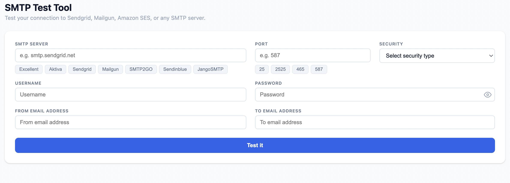

# SMTP Test Tool

A web-based SMTP connection tester with real-time conversation streaming. Enter your SMTP credentials, click **Test it**, and watch the raw SMTP handshake stream live — line by line.

Functionally similar to [gmass.co/smtp-test](https://www.gmass.co/smtp-test), with a clean light-mode UI and no data persistence (credentials never leave your session).



## Features

- **Real-time streaming** — SMTP conversation streams via SSE, line by line as it happens
- **Color-coded log** — outgoing (gray), success 2xx (green), challenge 3xx (amber), errors (red)
- **Server presets** — one-click fill for Sendgrid, Mailgun, SMTP2GO, Sendinblue, JangoSMTP
- **Port presets** — quick select 25, 2525, 465, 587
- **Security modes** — Auto, None, SSL (direct TLS), TLS (STARTTLS upgrade)
- **Privacy-first** — no logs, no history, no disk writes; credentials live only for the duration of the request
- **Configurable presets** — edit `server/presets.json` to add, remove, or change providers

## Getting Started

### Prerequisites

- Node.js 18+
- npm

### Install

```bash
git clone git@github.com:nugiabdiansyah/smtp-test-tool.git
cd smtp-test-tool
npm install
npm install --prefix server
npm install --prefix client
```

### Development

```bash
npm run dev
```

- Express API: `http://localhost:3001`
- Vite dev server: `http://localhost:5173`

### Production

```bash
npm run build   # compile React to client/dist/
npm start       # serve on http://localhost:3001
```

## Configuration

Edit `server/presets.json` to customize the SMTP server preset buttons:

```json
[
  { "name": "Sendgrid",   "host": "smtp.sendgrid.net",    "port": 587, "security": "tls" },
  { "name": "Mailgun",    "host": "smtp.mailgun.org",     "port": 587, "security": "tls" },
  { "name": "SMTP2GO",    "host": "mail.smtp2go.com",     "port": 587, "security": "tls" },
  { "name": "Sendinblue", "host": "smtp-relay.brevo.com", "port": 587, "security": "tls" },
  { "name": "JangoSMTP",  "host": "mail.jangostmp.net",   "port": 587, "security": "tls" }
]
```

Restart the server after changes.

## Project Structure

```
smtp-test-tool/
├── server/
│   ├── index.js        # Express app, routes, rate limiting, static serving
│   ├── smtp.js         # Raw TCP/TLS SMTP state machine + SSE emit
│   ├── validate.js     # Input validation
│   ├── sessions.js     # In-memory session Map with TTL cleanup
│   ├── presets.json    # Editable SMTP provider presets
│   └── tests/          # Node built-in test runner (23 tests)
├── client/
│   └── src/
│       ├── App.jsx              # Top-level state, SSE flow
│       ├── components/
│       │   ├── PresetToggle.jsx
│       │   ├── SmtpForm.jsx
│       │   └── ConversationLog.jsx
│       └── index.css
└── package.json        # Root scripts: dev, build, start
```

## Running Tests

```bash
cd server && node --test tests/validate.test.js tests/sessions.test.js tests/api.test.js
```

## Security Notes

- Rate limited to 20 requests per minute per IP
- 15-second timeout per SMTP connection
- Credentials are base64-encoded in `AUTH LOGIN` (as per SMTP spec) but displayed as `[credentials sent]` in the log
- TLS certificate validation is disabled (`rejectUnauthorized: false`) — appropriate for a diagnostic tool that needs to connect to misconfigured servers
- **Self-hosted use only** — no SSRF mitigation for private IP ranges; do not expose publicly without adding network-level controls

## License

MIT — see [LICENSE](LICENSE)
